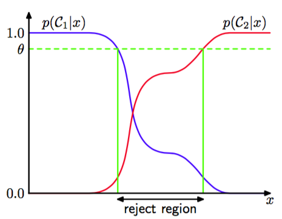

我们知道，错误分类来自于输入空间中，最大的后验概率$$ p(C_k|x) $$明显的小于1（或同样的，不同类别的联合分布$$ p(x, C_k) $$的值很接近）的那些区域。对于这些区域的类别相对的不确定。在一些应用中，应当避免在已经作出分类决策的强烈预计低错误率的样本上再做决策，这就是拒绝选项（reject
option）。举个例子，在假想的医学诊断例子中，使用自动化的系统来对那些几乎没有疑问的X光片进行分类，然后把不容易分类的X光片留给人类的专家是比较合适的做法。可以采用阈值$$ \theta $$，拒绝那些最大后验概率$$ p(C_k|x) $$小于等于$$ \theta $$的输入$$ x $$来达到这个目的。图1.26展示了一元输入变量$$ x $$的二元分类问题。

      
图 1.26: 拒绝选项

注意，当$$ \theta = 1 $$时，所有的样本都被拒绝。而对于有$$ K $$个类别的问题，设置$$ \theta < 1 / K$$将会确保没有样本被拒绝。因此被拒绝的样本比例由$$ \theta $$控制。    

可以很容易的把拒绝规则推广到最小化损失期望。当确定损失矩阵时，需要同时考虑拒绝决策所带来的损失。    

