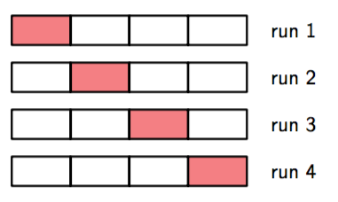

在我们使用最小二乘的多项式曲线拟合中，我们知道存在一个最优的阶数使它具有最好的泛化能力。多项式的阶数控制着模型的自由变量的数量，从而控制模型的复杂度。带有正则化的最小二乘，正则化系数$$ \lambda
$$同样控制着模型的有效复杂度。而对于更复杂的模型，如：混合分布和神经网络，它们有多个参数来控制复杂度。在实际应用中，我们需要确定这样的参数的值，这样做的主要目的通常是为了能更好的对新数据进行预测。此外，除了找到模型的合适的复杂度参数之外，可能还希望找到一个不同类型模型的范围，以便能够找到对于特定应用的最好的模型。    

在最大似然方法中，我们已经看到，由于过拟问题，模型通过数据训练后，对未知的参数的预测表现的并不好。如果数据量丰富，一个简单的方法是使用其中的一部分可用数据，训练出一系列模型，或确定某个模型的一系列模型复杂度参数，然后使用独立数据，有时被称为验证集（validation
set），比较各个模型的预测能力，选择最优的那个。如果模型设计使用有限的数据集迭代多次，那么对于验证数据会发生一定程度的过拟合，这时候就需要备用的第三个测试集（test set）来最终评估被选择模型的表现。    

在很多应用中，能提供的训练和测试数据是有限的，为了更好的构建模型，我们希望尽可能的使用可用的数据来进行训练。然而，如果验证集比较小，它对预测表现的估计就会有一定的噪声。解决这个困境的一个方法是使用交叉验证（cross-validation），就像图1.18展示的那样。这种方法使用$$ (S - 1) / S $$的可用数据用来训练，同时使用所有的数据来评估表现。当数据相当稀疏时，使得$$ S = N $$是比较合适的选择。其中$$ N $$是数据集的量，这种技术就叫留一法。    

      
图 1.18: 参数为 S 的交叉验证方法,这里说明了 S = 4 的情形。以能够得到的数据为输入，将其划分为S组（最简单的情况下，S等于数据的个数）。然后，S − 1组数据被用于训练一组模型，然后使用剩余的一组数据进行评估。然后对于所有S的可能选择重复进行这一步骤，使用剩余的一组（这里用红色标记出来）进行评估。之后，对S轮运行结果的表现得分求平均值。

交叉验证的一个主要的缺点是需要进行的训练的次数随着因子$$ S
$$增加，这对于训练本身很耗时的模型来说是个大问题。像这样使用分开的数据集来评估表现的交叉验证还有一个问题，对于那些有多个复杂度参数的模型（举个例子：有多个正则化参数的模型）在最坏的情况下，确定这些参数的组合所需的训练次数可能是参数个数的指数函数。显然我们需要一种更好的方法。理想情况下，这应该只依赖于训练数据，并且超参数的确定与模型类型的选择可以通过一次训练得出。因此，需要找到一种只依赖于训练数据的表现度量，并且不会受过拟所产生的偏置的影响。     

历史上，各种各样的通过增加惩罚项来补偿复杂模型的过拟问题来尝试修正最大似然的偏置的“信息准则”被提出来。例如：赤池信息准则（Akaike information criterion），或简称为AIC（Akaike, 1974），选择使下面表达式最大的模型：    

$$
\ln p(D|w_{ML}) - M \tag{1.73}
$$

这里的$$ p(D|w_{ML}) $$是最合适的对数似然函数，$$ M $$是模型中的可调节参数。这个量的一个被叫做贝叶斯信息准则(Bayesian information criterion)或简称BIC的变体将在4.4.1节中介绍。这样的准则没有考虑到模型参数的不确定性，所以在实际应用中它们倾向于选择过于简单的模型。在3.4节的完全的贝叶斯方法的讨论中，我们会看到，这种方法如何自然的，有原则的确定复杂度的惩罚项。    

