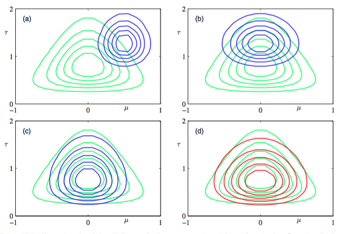

我们现在使用一元变量$$ x $$上的高斯分布来说明分解变分近似（MacKay, 2003）。我们的目标是在给定$$ x $$的观测值的数据集$$ D = \{x_1,...,x_N\} $$的情况下，推断均值$$ \mu $$和精度$$ \tau $$的后验概率分布。其中，我们假设数据是独立地从高斯分布中抽取的。似然函数为     

$$
p(D|\mu,\tau) = \left(\frac{\tau}{2\pi}\right)^{N/2}exp\left\{-\frac{\tau}{2}\sum\limits_{n=1}^N(x_n - \mu)^2\right\} \tag{10.21}
$$    

我们现在引入$$ \mu, \tau $$的共轭先验分布，形式为     

$$
\begin{eqnarray}
p(\mu|\tau) &=& \mathcal{N}(\mu|\mu_0,(\lambda_0\tau)^{-1}) \tag{10.22} \\
p(\tau) &=& Gam(tau|a_0,b_0) \tag{10.23}
\end{eqnarray}
$$    

其中$$ Gam(\tau | a_0,b_0) $$是式（2.146）定义的Gamma分布。这些分布共同给出了一个高斯-Gamma共轭先验分布。      

对于这个简单的问题，后验概率可以求出精确解，并且形式还是高斯-Gamma分布。然而，为了讲解的目的，我们会考虑对后验概率分布的一个分解变分近似，形式为     

$$
q(\mu,\tau) = q_\mu(\mu)q_\tau(\tau) \tag{10.24}
$$     

注意，真实的后验概率分布不可以按照这种形式进行分解。最优的因子$$ q_\mu(\mu), q_\tau(\tau) $$可以从一般的结果（10.9）中得到，如下所述。对于$$ q_\mu(\mu) $$，我们有     

$$
\begin{eqnarray}
\ln q_\mu^* &=& \mathbb{E}_\tau[\ln p(D|\mu,\tau) + \ln p(\mu|\tau)] + const \\
&=& -\frac{\mathbb{E}[\tau]}{2}\left\{\lambda_0(\mu - \mu_0)^2 + \sum\limits_{n=1}^N(x_n - \mu)^2\right\} + const \tag{10.25}
\end{eqnarray}
$$     

对于$$ \mu $$配平方，我们看到$$ q_\mu(\mu) $$是一个高斯分布$$ \mathcal{N}(\mu|\mu_N , \lambda_N^{−1}) $$，其中，均值和方差为     

$$
\begin{eqnarray}
\mu_N &=& \frac{\lambda_0\mu_0 + N\bar{x}}{\lambda_0 + N} \tag{10.26} \\
\lambda_N &=& (\lambda_0 + N)\mathbb{E}[\tau] \tag{10.27}
\end{eqnarray}
$$

注意，对于$$ N \to \infty $$，这给出了最大似然的结果，其中$$ \mu_N = \bar{x} $$，精度为无穷大。     

类似地，因子$$ q_\tau(\tau) $$的最优解为     

$$
\begin{eqnarray}
\ln q_\tau^*(\tau) &=& \mathbb{E}_\mu[\ln p(D|\mu,\tau) + \ln p(\mu|\tau)] + \ln p(\tau) + const \\
&=& (a_0 - 1)\ln\tau - b_0\tau + \frac{N + 1}{2}\ln\tau \\
& & -\frac{\tau}{2}\mathbb{E}_\mu\left[\sum\limits_{n=1}^N(x_n - \mu)^2 + \lambda_0(\mu - \mu_0)^2\right] + const \tag{10.28}
\end{eqnarray}
$$     

因此$$ q_\tau(\tau) $$是一个Gamma分布$$ Gam(\tau|a_N,b_N) $$，参数为      

$$
\begin{eqnarray}
a_N &=& a_0 + \frac{N + 1}{2} \tag{10.29} \\
b_N &=& b_0 + \frac{1}{2}\mathbb{E}_\mu\left[\sum\limits_{n=1}^N(x_n - \mu)^2 + \lambda_0(\mu - \mu_0)^2\right] \tag{10.30}
\end{eqnarray}
$$

同样的，当$$ N \to \infty $$时，它的行为与预期相符。   

应该强调的是，我们不假设最优概率分布$$ q_\mu(\mu), q_\tau(\tau) $$的具体的函数形式。它们的函数形式从似然函数和对应的共轭先验分布中自然地得到。     

因此,我们得到了最优概率分布$$ q_\mu(\mu), q_\tau(\tau) $$的表达式，每个表达式依赖于关于其他概率分布计算得到的矩。因此，一种寻找解的方法是对例如$$ \mathbb{E}[\tau] $$进行一个初始的猜测，然后使用这个猜测来重新计算概率分布$$ q_\mu(\mu) $$。给定这个修正的概率分布之后，我们接下来可以计算所需的矩$$ \mathbb{E}[\mu], \mathbb{E}[\mu_2] $$，并且使用这些矩来重新计算概率分布$$ q_\tau(\tau)
$$，以此类推。由于这个例子中，隐含变量空间是二维的，因此我们可以用图形来说明后验概率分布的变分近似过程。我们画出了真实后验概率的轮廓线和分解近似的等高线，如图10.4所示。

      
图 10.4 一元高斯分布的均值$$ \mu $$和精度$$ \tau $$的变分推断的例子。真实后验概率分布$$ p(\mu,\tau | D) $$用绿色曲线表示。(a)初始的分解近似$$ q_\mu(\mu)q_\tau(\tau) $$，用蓝色曲线表示。(b)重新估计了因子$$ q_\mu(\mu) $$之后的结果。(c)重新估计了因子$$ q_\tau(\tau) $$之后的结果。(d)最优分解近似的轮廓线，其中迭代方法收敛，用红色表示。     

通常，我们需要使用一种迭代的方法来得到最优分解后验概率分布的解。然而，对于我们这里讨论的非常简单的例子来说，我们可以通过求解最优因子$$ q_\mu(\mu), q_\tau(\tau) $$的方程，得到一个显式的解。在做这件事之前，我们可以通过考虑无信息先验来简化表达式。无信息先验分布中，$$ \mu_0 = a_0 = b_0 = \lambda_0 = 0
$$。虽然这些参数设置对应于一个反常先验，但是我们看到后验概率分布仍然具有良好的定义。使用Gamma分布的均值的标准结果$$ \mathbb{E}[\tau] = a_N $$，以及式（10.29）和式（10.30），我们有    

$$
\frac{1}{\mathbb{E}[\tau]} = \mathbb{E}\left[\frac{1}{N + 1}\sum\limits_{n=1}^N(x_n - \mu)^2\right] + \frac{N}{N + 1}(\bar{x^2} - 2\bar{x}\mathbb{E}[\mu]+\mathbb{E}[\mu^2]) \tag{10.31}
$$

之后，使用式（10.26）和式（10.27），我们得到了$$ q_\mu(\mu) $$的一阶矩和二阶矩，形式为     

$$
\mathbb{E}[\mu] = \bar{x}, \mathbb{E}[\mu^2] = \bar{x}^2 + \frac{1}{N\mathbb{E}[\tau]} \tag{10.32}
$$     

现在，我们可以将这些矩代入式（10.31），然后解出$$ \mathbb{E}[\tau] $$，可得     

$$
\frac{1}{\mathbb{E}[\tau]} = (\bar{x^2} - \bar{x}^2) = \frac{1}{N}\sum\limits_{n=1}^N(x_n - \bar{x})^2 \tag{10.33}
$$     

对于高斯分布的贝叶斯推断的可理解的介绍，包括与最大似然方法的相比的优势的讨论，可以参考Minka(1998)。
