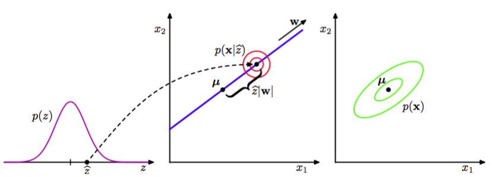

前一节讨论的PCA的形式所基于的是将数据线性投影到比原始数据空间维度更低的子空间内。我们现在说明，PCA也可以被视为概率潜在变量模型的最大似然解。PCA的这种形式，被称为概率PCA（probabilistic PCA），与传统的PCA相比，会带来如下几个优势。    

1. 概率PCA表示高斯分布的一个限制形式，其中自由参数的数量可以受到限制，同时仍然使 得模型能够描述数据集的主要的相关关系。    
2. 我们可以为PCA推导一个EM算法，这个算法在只有几个主要的特征向量需要求出的情况下，计算效率比较高，并且避免了计算数据协方差矩阵的中间步骤。    
3. 概率模型与EM的结合使得我们能够处理数据集里缺失值的问题。    
4. 概率PCA混合模型可以用一种有理有据的方式进行形式化，并且可以使用EM算法进行训练。    
5. 概率PCA构成了PCA的贝叶斯方法的基础，其中主子空间的维度可以自动从数据中找到。    
6. 似然函数的存在使得直接与其他的概率密度模型进行对比成为可能。相反，传统的PCA会给接近主子空间的数据点分配一个较低的重建代价，即使这些数据点的位置距离训练数据 任意远。    
7. 概率PCA可以被用来对类条件概率密度建模，因此可以应用于分类问题。    
8. 概率PCA模型可以用一种生成式的方式运行，从而可以按照某个概率分布生成样本。    

这种概率模型形式的PCA由Tipping and Bishop(1997，1999b)和Roweis(1998)独立提出。正如我们后面将会看到的那样，它与因子分析(factor analysis)密切相关(Basilevsky， 1994)。    

概率PCA是线性高斯框架的一个简单的例子，其中所有的边缘概率分布和条件概率分布都是高斯分布。我们可以按照下面的方式建立概率PCA模型。首先显式地引入潜在变量$$ z $$，对应于主成分子空间。接下来我们定义潜在变量上的一个高斯先验分布$$ p(z) $$以及以潜在变量的值为条件，观测变量$$ x $$的高斯条件概率分布$$ p(x|z) $$。具体来说，$$ z $$上的先验概率分布是一个0均值单位协方差的高斯分布    

$$
p(z) = \mathcal{N}(z|0,I) \tag{12.31}
$$

类似的，以潜在变量z的值为条件，观测变量x的条件概率分布还是高斯分布，形式为    

$$
p(x|z) = \mathcal{N}(x|Wz + \mu, \sigma^2I) \tag{12.32}
$$    

其中$$ x $$的均值是$$ z $$的一个一般的线性函数，由$$ D \times M $$的矩阵$$ W $$和$$ D $$维向量$$ \mu $$控制。注意，可以关于$$ x $$的各个元素进行分解，换句话说，这是朴素贝叶斯模型的一个例子。正如我们稍后会看到 的那样，$$ W $$的列张成了数据空间的一个线性子空间，对应于主子空间。模型中的另一个参数$$ \sigma^2 $$控制了条件概率分布的方差。注意，我们可以不失一般性地假设潜在变量分布$$ p(z)
$$服从一个0均值单位协方差的高斯分布，因为更一般的高斯分布会产生一个等价的概率模型。    

我们可以从生成式的观点看待概率PCA模型，其中观测值的一个采样值通过下面的方式获得：首先为潜在变量选择一个值，然后以这个潜在变量的值为条件，对观测变量采样。具体来说，$$ D $$维观测变量$$ x $$由$$ M $$维潜在变量$$ z $$的一个线性变换附加一个高斯“噪声”定义，即     

$$
x = Wz + \mu + \epsilon \tag{12.33}
$$     

其中$$ z $$是一个$$ M $$维高斯潜在变量，$$ \epsilon $$是一个$$ D $$维0均值高斯分布的噪声变量，协方差为$$ \sigma^2I $$。这个生成式过程如图12.9所示。    

      
图 12.9 概率PCA模型的生成式观点的说明，数据空间为二维，潜在空间为一维。一个观测数据点$$ x $$的生成方式为：首先从潜在变量的先验分布$$ p(z) $$中抽取一个潜在变量的值$$ z $$，然后从一个各向同性的高斯分布（用红色圆圈表示）中抽取一个$$ x $$的值，这个各向同性的高斯分布的均值为$$ w\hat{z} + \mu $$，协方差为$$ \sigma^2I $$。绿色椭圆画出了边缘概率分布$$ p(x) $$的密度等高线。

注意，这个框架基于的是从潜在空间到数据空间的一个映射，这与之前讨论的PCA的传统观点不同。从数据空间到潜在空间的逆映射可以通过使用贝叶斯定理的方式得到。     

假设我们希望使用最大似然的方式确定参数$$ W $$， $$ \mu $$和$$ \sigma^2 $$的值。为了写出似然函数的表达式，我们需要观测变量的边缘概率分布$$ p(x) $$的表达式。根据概率的加法规则和乘积规则，边缘概率分布的形式为    

$$
p(x) = \int p(x|z)p(z)dz \tag{12.34}
$$    

由于这对应于一个线性高斯模型，因此边缘概率分布还是高斯分布，形式为    

$$
p(x) = \mathcal{N}(x|\mu,C) \tag{12.35}
$$     

其中$$ D \times D $$协方差矩阵$$ C $$被定义为    

$$
C = WW^T + \sigma^2I \tag{12.36}
$$     

这个结果也可以更直接地推导出来。我们注意到预测概率分布是高斯分布，然后使用式（12.33）计算它的均值和协方差，结果为     

$$
\begin{eqnarray}
\mathbb{E}[x] &=& \mathbb{E}[Wz + \mu + \epsilon] = \mu \tag{12.37} \\
cov[x] &=& \mathbb{E}[(Wz + \epsilon)(Wz + \epsilon)^T] \\
&=& \mathbb{E}[Wzz^TW^T] + \mathbb{E}[\epsilon\epsilon^T] = WW^T + \sigma^2I \tag{12.38}
\end{eqnarray}
$$

其中我们使用了下面的事实：$$ z $$和$$ \epsilon $$是独立的随机变量，因此非相关。    

直观地说，我们可以将概率分布$$ p(x) $$想象成由一个各向同性的高斯“喷雾罐”定义，然后将这个喷雾罐移过主子空间，喷射高斯分布的墨水，喷射的概率密度由$$ \sigma^2 $$定义，且权值为先验概率 分布。累积的墨水密度产生了“薄煎饼”形状的概率分布，表示边缘概率密度$$ p(x) $$。

预测分布$$ p(x) $$由参数$$ \mu, W $$和$$ \sigma^2 $$控制。然而，这些参数中存在冗余性，对应于潜在空间坐标的旋转。为了说明这一点，考虑一个矩阵$$ \tilde{W} = WR $$，其中$$ R $$是一个正交矩阵。使用正交性质$$ RR^T = I $$，我们看到协方差矩阵$$ C $$中的$$ \tilde{W}\tilde{W}^T $$的形式为    

$$
\tilde{W}\tilde{W}^T = WRR^TW^T = WW^T \tag{12.39}
$$    

因此与$$ R $$独立。从而有一大类的矩阵$$ \tilde{W} $$会给出相同的预测分布。这种不变性可以理解为潜在空间中的旋转。我们稍后会回到对模型独立参数数量的讨论中。    

当我们计算预测分布时，我们需要$$ C^{−1} $$，这涉及到对一个$$ D \times D $$的矩阵求逆。使用矩阵求逆的恒等式（C.7），所需的计算量可以被化简。使用这个矩阵恒等式得到的结果为    

$$
C^{-1} = \sigma^{-2}I - \sigma^{-2}WM^{-1}W^T \tag{12.40}
$$     

其中$$ M \times M $$的矩阵$$ M $$的定义为    

$$
M = W^TW + \sigma^2I \tag{12.41}
$$

由于我们对$$ M $$进行求逆而不是直接对$$ C $$求逆，因此计算$$ C^{−1} $$从$$ O(D^3) $$减小到了$$ O(M^3) $$。     

与预测分布$$ p(x) $$一样，我们也需要后验概率分布$$ p(z|x) $$，这可以直接使用式（2.116）给出的线性高斯模型的结果写出来，结果为     

$$
p(z|x) = \mathcal{N}(z|M^{−1}W^T(x−\mu),\sigma^2M^{−1}) \tag{12.42}
$$    

注意，后验均值依赖于$$ x $$，而后验协方差与$$ x $$无关。
