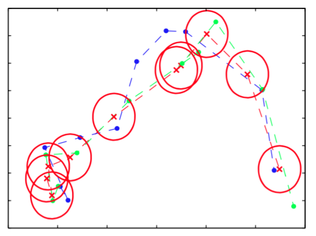

我们现在考虑寻找以观测序列为条件的潜在变量的边缘概率分布的问题。在实时应用中，对于给定的参数设置，我们也希望以观测数据$$ x_1,...,x_{n−1} $$为条件，对于下一个潜在状态$$ z_n $$以及下一个观测$$ x_n $$做出预测。这些推断问题可以使用加-乘算法高效地解决，这个算法在线性动态系统的问题中会给出Kalman滤波方程和Kalman平滑方程。    

值得强调的是，因为线性动态系统是线性高斯模型，因此所有潜在变量和观测变量上的联合概率分布是高斯分布，因此原则上我们可以使用之前章节推导的多元变量高斯分布的边缘概率 和条件概率的标准结果来解决这个推断问题。加-乘算法的作用是为这些计算提供了一个更加高效的方式。    

线性动态系统与隐马尔可夫模型具有相同的分解方式，由公式(13.6)给出，并且由图13.14 和图13.15的因子图描述。于是，推断问题的形式完全相同，唯一的差别在于潜在变量上的求和被替换为积分。首先，我们考虑前向方程，其中我们将$$ z_N $$看做根结点，然后从叶结点$$ h(z_1) $$将信息传递到根结点。根据式（13.77），初始信息服从高斯分布，并且由于每个因子都服从高斯分布，因此所有后续的信息也都服从高斯分布。按照传统，我们传递的信息是标准化的边缘概率分布，对应于$$ p(z_n|x_1,...,x_n) $$，我们将其记作    

$$
\hat{\alpha}(z_n) = \mathcal{N}(z_n|\mu_n,V_n) \tag{13.84}
$$    

这与式（13.59）给出的隐马尔科夫模型的离散变量情形的缩放变量$$ \hat{\alpha}(z_n) $$的传播完全相同，因此递归方程的形式为    

$$
c_n\hat{\alpha}(z_n) = p(x_n|z_n)\int\hat{\alpha}(z_{n−1})p(z_n|z_{n−1})dz_{n−1} \tag{13.85}
$$     

使用式（13.75）和（13.76）替换$$ p(z_n|z_{n−1}) $$和$$ p(x_n|z_n) $$，然后使用式（13.84），我们看到（13.85）变成了    

$$
\begin{eqnarray}
c_n\mathcal{N}(z_n|\mu_n,V_n) = \mathcal{N}(x_n|Cz_n,\Sigma) \\
\int\mathcal{N}(z_n|Az_{n-1},\Gamma)\mathcal{N}(z_{n-1}|\mu_{n-1},V_{n-1})dz_{n-1} \tag{13.86}
\end{eqnarray}
$$    

这里我们假设$$ \mu_{n−1} $$和$$ V_{n−1} $$是已知的，并且通过计算式（13.86）中的积分，我们希望确定$$ \mu_n $$和$$ V_n $$的值。使用式（2.115）给出的结果，这个积分很容易计算。我们有    

$$
\begin{eqnarray}
\int\mathcal{N}(z_n|Az_{n-1},\Gamma)\mathcal{N}(z_{n-1}|\mu_{n-1},V_{n-1})dz_{n-1} \\
= \mathcal{N}(z_n|A\mu_{n-1},P_{n-1}) \tag{13.87}
\end{eqnarray}
$$    

其中我们定义了    

$$
P_{n-1} = AV_{n-1}A^T + \Gamma \tag{13.88}
$$    

我们现在可以将这个结果与式（13.86）右侧的第一个因子结合，使用式（2.115）和（2.116），有    

$$
\begin{eqnarray}
\mu_n &=& Aμn−1 + Kn(xn − CAμn−1) \tag{13.89} \\
V_n &=& (I − K_nC)P_{n−1} \tag{13.90} \\
c_n &=& \mathcal{N}(x_n |CA\mu_{n−1}, CP_{n−1}C^T + \Sigma) \tag{13.91}
\end{eqnarray}
$$    

这里，我们使用了矩阵求逆的恒等式（C.5）和（C.7），并且定义了Kalman增益矩阵(Kalman gain matrix)    

$$
K_n = P_{n-1}C^T(CP_{n-1}C^T + \Sigma)^{-1} \tag{13.92}
$$     

因此，给定$$ \mu_{n−1} $$和$$ V_{n−1} $$，以及新的观测$$ x_n $$，我们可以计算$$ z_n $$的高斯边缘分布，均值为$$ \mu_n $$，协方差为$$ V_n $$，标准化系数为$$ c_n $$。    

这些递归方程的初始条件为    

$$
c_1\hat{\alpha}(z_1) = p(z_1)p(x_1|z_1) \tag{13.93}
$$    

由于$$ p(z_1) $$由式（13.77）给出，$$ p(x_1|z_1) $$由式（13.76）给出，因此我们可以再次使用（2.115）计算$$ c_1 $$，使用（2.116）计算$$ \mu_1 $$和$$ V_1 $$，结果为    

$$
\begin{eqnarray}
\mu_1 &=& \mu_0 + K_1(x_1 - C\mu_0 \tag{13.94} \\
V_1 &=& (I - K_1C)P_0 \tag{13.95} \\
c_1 &=& \mathcal{N}(x_1|C\mu_0,CP_0C^T + \Sigma) \tag{13.96}
\end{eqnarray}
$$    

其中    

$$
K_1 = P_0C^T(CP_0C^T + \Sigma)^{-1} \tag{13.97}
$$    

类似的，线性动态系统的似然函数由式（13.63）给出，其中因子$$ c_n $$使用Kalman滤波方程求解。    

我们可以直观地给出从$$ z_{n−1} $$上的后验边缘分布到$$ z_n $$上的后验边缘分布的步骤，如下所述。在式（13.89）中，我们可以将$$ A\mu_{n−1} $$看成$$ z_n $$上的均值的预测，得到这个预测的方法是在$$ z_{n−1} $$上取均值，然后使用一个前向的步骤，使用转移概率矩阵$$ A $$进行投影。预测均值会给出$$ x_n $$的一个预测观测$$ CA\mu_{n−1} $$，得到这个预测的方法是讲发射概率矩阵$$ C
$$作用在预测的隐含状态均值上。我们可以将隐含变量分布的均值的更新方程（13.89）看成将预测分布的均值$$ A\mu_{n−1} $$加上一个修正项，这个修正项正比于预测观测与实际观测之间的误差$$ x_n − CA\mu_{n−1} $$。 这个修正的系数由Kalman增益矩阵给出。因此我们可以将Kalman滤波的过程看成下面的过程：首先做出后续的预测，然后使用新的观测来修正这些预测。图13.21给出了图形说明。    

      
图 13.21 线性动态系统可以被看成一个步骤序列，其中由于传播造成的状态变量的逐渐增大的不确定性由新数据的到达所补偿。在左图中，蓝色曲线表示概率分布$$ p(z_{n−1}|x_1,...,x_{n−1}) $$，它整合了截止到第$$ n − 1 $$步的所有的数据。由方差非零的转移概率$$ p(z_n|z_{n−1}) $$产生的传播过程给出了概率分布$$ p(z_n|x_1,...,x_{n−1})
$$，在中间图中表示为红色曲线。注意，与蓝色曲线相比，红色曲线更宽，并且有所偏移。为了对比，蓝色曲线用虚线画出。下一个数据观测$$ x_n $$通过发射概率密度$$ p(x_n|z_n) $$产生贡献。右图中的绿色曲线表示发射概率与$$ z_n $$的函数关系。注意，它不是关于$$ z_n $$的概率密度，因此没有被归标准化。使用这个新的数据点会产生状态概率密度的一个修正的概率分布$$ p(z_n |x_1,...,x_n) $$,用蓝色表示。我们看到，与$$ p(z_n|x_1,...,x_{n−1})
$$相比，数据的观测使得概率分布产生偏移，并且变得更窄了。为了对比，$$ p(z_n |x_1,...,x_{n−1}) $$在右图中用红色虚线表示。

如果我们考虑下面的情形：与潜在变量的变化速率相比，测量误差相对较小，那么我们看到zn的后验概率分布仅仅依赖于当前的测量xn，这与我们在本节开始时的简单例子中获得的直观感受相符。类似地，如果与观测的噪声水平相比，潜在变量的变化速度较慢，那么我们发 现zn的后验均值等于对截止到那个时间的所有测量求平均。   

Kalman滤波的一个重要应用是跟踪。图13.22使用一个物体在二维空间移动的简单例子说明了这一点。    

      
图 13.22 线性动态系统用于移动物体跟踪的一个说明。蓝点表示在连续的时刻，二维空间中物体的真实位置，绿点表示带有噪声的对位置的测量，红色叉号表示使用Kalman滤波方程推断出的后验概率分布的均值。推断位置的协方差由红色椭圆表示，它对应于一个标准差的轮廓线。

目前位置，我们已经解决了在给定$$ x_1 $$到$$ x_n $$的观测的情况下寻找结点zn的后验边缘概率的问题。接下来，我们考虑在给定$$ x_1 $$到$$ x_N $$的所有观测的条件下，寻找结点$$ z_n
$$的边缘概率的问题。对于时序数据，这对应于将未来的观测以及过去的观测全部包含在内。虽然这无法用于实时预测，但是它在学习模型的参数中起着重要的作用。通过与隐马尔科夫模型的类比，这个问题可以这样求解：从结点$$ x_N $$将信息反向传递到结点$$ x_1 $$，然后将这个信息与计算$$ \hat{\alpha}(z_n) $$的前向信息传递阶段得到的信息相结合。    

在LDS的文献中，通常根据$$ \gamma(z_n) = \hat{\alpha}(z_n)\hat{\beta}(z_n) $$表示后向递归公式，而是不根据$$ \hat{\beta}(z_n) $$。由于$$ \gamma(z_n) $$一定也是高斯分布，因此我们有

$$
\gamma(z_n)=\hat{\alpha}(z_n)\hat{\beta}(z_n) = \mathcal{N}(z_n|\hat{\mu}_n, \hat{V}_n) \tag{13.98}
$$    

为了推导所求的递归方程，我们从$$ \hat{\beta}(z_n) $$的反向递归方程（13.62）开始，它对于连续潜在变量，可以写成    

$$
c_{n+1}\hat{\beta}(z_n) = \int\hat{\beta}(z_{n+1})p(x_{n+1}|z_{n+1})p(z_{n+1}|z_n)dz_{n+1} \tag{13.99}
$$    

我们现在将（13.99）两侧乘以$$ \hat{\alpha}(z_n) $$，使用式（13.75）和（13.76）消去$$ p(x_{n+1}|z_{n+1}) $$和$$ p(z_{n+1}|z_n) $$。然后，我们使用（13.89）、（13.90）和（13.91），以及（13.98），经过一些计算，我们有    

$$
\begin{eqnarray}
\hat{\mu}_n &=& \mu_n + J_n(\hat{\mu}_{n+1} + A\mu_n) \tag{13.100} \\
\hat{V}_n &=& V_n + J_n\left(\hat{V}_{n+1} - P_n\right)J_n^T \tag{13.101} \\
&=& \frac{\mathcal{N}(z_{n-1}|\mu_{n-1},V_{n-1})\mathcal{N}(z_n|Az_{n-1},\Gamma)\mathcal{N}(x_n|Cz_n,\Sigma)\mathcal{N}(z_n|\hat{\mu}_n,\hat{V}_n)}{c_n\hat{\alpha}(z_n)} \tag{13.103}
\end{eqnarray}
$$    

其中我们定义了    

$$
J_n = V_nA^T(P_n)^{-1} \tag{13.102}
$$    

并且我们使用了$$ AV_n =P_nJ_n^T $$。注意，这些递归方程要求首先完成前向传递的过程，从而在后向过程中可以使用$$ \mu_n $$和$$ V_n $$。

对于EM算法，我们也需要求出一对变量的后验边缘分布，它可以通过公式(13.65)求出， 形式为     

$$
\begin{eqnarray}
\xi(z_{n-1},z_n) &=& (c_n)^{-1}\hat{\alpha}(z_{n-1})p(x_n|z_n)p(z_n|z_{n-1})\hat{\beta}(z_n) \\
\end{eqnarray}
$$    

使用式（13.84）消去$$ \hat{\alpha}(z_n) $$，整理，我们看到$$ \xi(z_{n−1}, z_n) $$是一个高斯分布，均值为$$ [\hat{\mu}_{n−1},\hat{\mu}_n]^T $$，$$ z_n $$和$$ z_{n−1} $$之间的协方差为

$$
cov[z_{n-1},z_n] = J_{n-1}\hat{V}_n \tag{13.104}
$$
