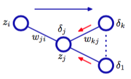

现在，我们推导适用于有任意前馈拓扑结构，任意可微的非线性激活函数，以及一大类的误差函数的一般神经网络的反向传播算法。推导的结果将会使用有一个单层的sigmoid隐含单元及平方和误差函数的简单层次网络结构来阐述。    

需要实际应用中的误差函数，如：独立同分布数据集上定义的最大似然，由每一项对应于训练集的一个数据点的求和式组成：    

$$
E(w) = \sum\limits_{n=1}^NE_n(w) \tag{5.44}
$$

这里，我们要考虑计算误差函数中$$ \nabla E_n(w) $$这样的项的问题。这可以直接使用顺序优化的方法计算，或使用批处理方法在训练集上进行累加。    

首先，考虑输出$$ y_k $$是输入$$ x_i $$的线性组合的简单线性模型，即

$$
y_k = \sum\limits_iw_{ki}x_i \tag{5.45}
$$

对于特定的输入模式$$ n $$，误差函数具有

$$
E_n = \frac{1}{2}\sum\limits_k(y_{nk} - t_{nk})^2 \tag{5.46}
$$

的形式，其中$$ y_{nk} = y_k(x_n,w) $$。这个误差函数关于权值$$ w_{ji} $$的梯度由

$$
\frac{\partial E_n}{\partial w_{ji}} = (y_{nj} - t_{nj})x_{ni} \tag{5.47}
$$

给出，它可以解释成与链接$$ w_{ji} $$的输出端相关联的“误差信号”$$ y_{nj} − t_{nj} $$和与链接的输入端相关联的 变量$$ x_{ni} $$的乘积的“局部”计算。在4.3.2节中，我们看到logistic sigmoid激活函数与交叉熵误差函数，以及softmax激活函数与与之对应的交叉熵误差函数，也会产生同样的结果。这里，我们会看到这个简单结果如何扩展到更复杂的多层前馈神经网络中。    

在一个广义的前馈神经网络中，每个单元都会计算输入的加权和：    

$$
a_j = \sum\limits_iw_{ji}z_i \tag{5.48}
$$

其中$$ z_i $$是单元的激活或输入，它向单元$$ j $$发送连接，$$ w_{ji} $$是这个连接的权值。在5.1节中，我们看到偏置可以通过引入一个额外的激活恒为$$ +1 $$单元或输入来集成到这个求和公式中。于是我们不需要显式的来处理偏置。式（5.48）的求和项是通过非线性激活函数$$ h(\dot) $$变换得到的单元$$ j $$的激活$$ z_j $$，形式为

$$
z_j = h(a_j) \tag{5.49}
$$

注意，式（5.48）的求和项中的一个或几个变量$$ z_i $$可以是输入，同样的，式（5.49）中的单元$$ j $$可以是输出。    

对于训练集中的每个模式，我们假定给网络提供了对应的输入向量，并反复应用式（5.48）（5.49）计算了网络中所有隐藏和输出单元的激活。由于这可以被看做网络中的一个向前流动的信息流，所以通常被称为正向传播（forward propagation）。    

现在考虑计算$$ E_n $$关于权值$$ w_{ji} $$的导数。各个单元的输出会依赖于某个特定的输入模式$$ n $$。但是，为了保持记号的简洁，我们将省略网络变量中的下标$$ n $$。首先，我们注意到$$ E_n $$只通过单元$$ j $$的求和之后的输入$$ a_j $$对权值$$ w_{ji} $$产生依赖。因此，我们可以应用偏导的链式法则，得到

$$
\frac{\partial E_n}{\partial w_{ji}} = \frac{\partial E_n}{\partial a_j}\frac{\partial a_j}{\partial w_{ji}} \tag{5.50}
$$

现在，我们介绍一个非常有用的记号

$$
\delta_j \equiv \frac{\partial E_n}{\partial a_j} \tag{5.51}
$$

其中$$ \delta $$通常被用来标记误差，原因我们稍后会看到。使用式（5.48）我们可以写成

$$
\frac{\partial a_j}{\partial w_{ji}} = z_i \tag{5.52}
$$

把式（5.51）（5.52）代入式（5.50），可以得到

$$
\frac{\partial E_n}{\partial w_{ji}} = \delta_jz_i \tag{5.53}
$$

式（5.53）告诉我们，要求的导数可以简单的通过将权值输出端单元的$$ \delta $$的值乘以权值输入端的$$ z $$的值的方式得到（对于偏置来说$$ z = 1 $$）。注意，这与本节开始时讨论的简单线性模型具有相同的形式。因此，为了计算导数，我们只需要计算网络中每个隐藏和输出结点的$$ \delta_j $$的值，然后应用式（5.53）即可。    

正如我们已经看到的那样，只要我们使用标准链接作为输出单元的激活函数，那么对于输出单元，就有

$$
\delta_k = y_k - t_k \tag{5.54}
$$

为了计算隐藏单元的$$ \delta $$，我们再一次使用偏导数的链式法则：

$$
\delta_j \equiv \frac{\partial E_n}{\partial a_j} = \sum\limits_k\frac{\partial E_n}{\partial a_k}\frac{\partial a_k}{\partial a_j} \tag{5.55}
$$

其中求和式的作用对象是单元$$ j $$发送链接的所有单元$$ k $$。图5.7阐释了单元的排列和权值。

      
图 5.7 排列与权值    

注意，标记为$$ k $$的单元，可以包含其他的隐藏单元和（或）输出单元。在给出式（5.55）时，我们使用了这个事实:$$ a_j $$的改变所造成的误差函数的改变的唯一来源是变量$$ a_k $$的改变。如果我们把式（5.51）给出的$$ \delta $$的定义代入式（5.55），然后使用式（5.48）（5.49），就得到了

$$
\delta_j = h'(a_j)\sum\limits_kw_{kj}\delta_k \tag{5.56}
$$

这个反向传播（backpropagation）公式。这表明，一个特定的隐藏单元的$$ \delta $$值可以通过将网络中更高层单元的$$ delta $$进行反向传播来得到。如图5.7所示。注意，式（5.56）中的求和项是由$$ w_{kj} $$的第一个下标得到的（对应于信息在网络中的反向传播），而在正向传播方程（5.10）中，求和过程针对的是第二个下标。由于我们已经知道了输出单元的$$ \delta $$，所以通过递归地应用式（5.56），我们可以计算前馈网络中所有隐藏单元的$$ \delta $$值，无论它的拓扑结构是什么样的。

于是，反向传播算法可以总结如下：

对于网络的一个输入向量$$ x_n $$，使用式（5.48）（5.49）进行正向传播，找到所有隐含单元和输出单元的激活。    
使用式（5.54）计算所有输出单元的$$ \delta_k $$。    
使用式（5.56）反向传播$$ \delta $$，获得网络中所有隐含单元的$$ \delta_j $$。    
使用式（5.53）计算导数。

对于批处理方法，总误差函数$$ E $$的导数可以通过对于训练集里的每个模式，重复上面的步骤，然后对所有的模式求和：

$$
\frac{\partial E}{\partial w_{ji}} = \sum\limits_n\frac{\partial E_n}{\partial w_{ji}} \tag{5.57}
$$

来获得。在上面的推导中，我们隐式地假设网络中的每个隐藏单元或输入单元都有相同的激活函数$$ h(\dot) $$。然而，这只需记录哪个单元具有哪种形式的$$ h(\dot) $$就可以把这个推导推广到不同的单元有各自的激活函数的情况。

