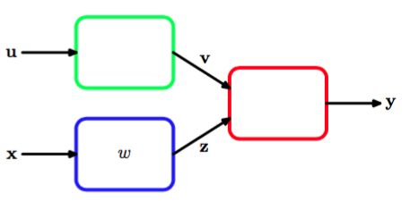

我们已经看到了误差函数关于权值的导数是如何通过网络中的误差反向传播来获得的。反向传播技术也可以用来计算其它类型的导数。这里，我们考虑元素的值是网络输出关于输入的导数的Jacobian矩阵的计算

$$
J_{ki} \equiv \frac{\partial y_k}{\partial x_i} \tag{5.70}
$$

其中，每个这样的导数计算时，其它的输入都是固定的。Jacobian矩阵在由许多不同模块构建的系统中很有用，如图5.8所示。

      
图 5.8: 模块化模式识别系统的例子，其中Jacobian矩阵可以用来将误差信号从输出模块在系统中反向传播到更早的模块    

每个模块可以由一个固定的或可调节的函数构成，它可以是线性的或非线性的，只要可微即可。假设我们想关于图5.8中的参数$$ w $$，最小化误差函数$$ E $$。误差函数的导数由

$$
\frac{\partial E}{\partial w} = \sum\limits_{k,j}\frac{\partial E}{\partial y_k}\frac{\partial y_k}{\partial z_j}\frac{\partial z_j}{\partial w} \tag{5.71}
$$

其中，图5.8中的红色模块的Jacobian矩阵出现在中间项。    

应为Jacobian矩阵提供了输出对每个输入变量的局部灵敏度的度量，所以它也允许与输入关联的任意已知的误差$$ \Delta x_i $$在训练过的网络中传播，从而估计它们对于输出误差$$ \Delta y_k $$的贡献。它们之前有一个只要$$ \vert \Delta x_i \vert $$够小，就成立的关系：

$$
\Delta y_k \simeq \sum\limits_i\frac{\partial y_k}{\partial x_i}\Delta x_i \tag{5.72}
$$

通常，训练过的神经网络表示的网络映射是非线性的，所以Jacobian矩阵的元素不会是常数，而是依赖于具体使用的输入向量。因此式（5.72）只在输入有较小的扰动时成立，而且对于每个新的输入变量，Jacobian矩阵需要重新计算。    

Jacobian矩阵可以使用与之前推导误差函数关于权值的导数类似的方法来使用反向传播来计算得到。我们以把元素$$ J_{ki} $$写成

$$
\begin{eqnarray}
J_{ki} = \frac{\partial y_k}{\partial x_i} &=& \sum\limits_j\frac{\partial y_k}{\partial a_j}\frac{\partial a_j}{\partial x_i} \\
&=& \sum\limits_jw_{ji}\frac{\partial y_k}{\partial a_j} \tag{5.73}
\end{eqnarray}
$$

的形式来开始，其中我们使用了式（5.48）。式（5.73）中的求和项作用于所有单元$$ i $$发送连接的单元$$ j $$上
（如：之前讨论的层次拓扑结构中的第一个隐藏层的所有单元）。我们现在一个递归的反向传播公式来确定导数$$ \partial y_k/\partial a_j $$

$$
\begin{eqnarray}
\frac{\partial y_k}{\partial a_j} &=& \sum\limits_l \frac{\partial y_k}{\partial a_l}\frac{\partial a_l}{\partial a_j} \\
&=& h'(a_j)\sum\limits_l w_{lj}\frac{\partial y_k}{\partial a_l} \tag{5.74}
\end{eqnarray}
$$

其中求和的对象是所有单元$$ j $$发送连接的单元$$ l $$（对应于$$ w_{lj} $$的第一个下标）。与之前一样，我们 使用了式（5.48）和式（5.49）。这个反向传播开始于导数可以直接从输出单元激活函数的函数形式中得到的输出单元。例如：如果对于每个输出单元，我们都有各自的sigmoid函数，那么

$$
\frac{\partial y_k}{\partial a_j} = \delta_{kj}\sigma '(a_j) \tag{5.75}
$$

其中，对于softmax输出我们有

$$
\frac{\partial y_k}{\partial a_j} = \delta_{kj}y_k - y_ky_j \tag{5.76}
$$

我们可以将计算Jacobian矩阵的方法总结如下。将输入空间中要寻找Jacobian矩阵的点映射成一个输入向量，将这个输入向量作为网络的输入，使用通常的正向传播方法，得到网络的所有隐藏单元和输出单元的激活。然后，对于Jacobian矩阵的每一行$$ k $$（对应于输出单元$$ k
$$），使用递归关系（5.74）进行反向传播。对于网络中所有的隐藏结点，以式（5.75）和式（5.76）开始我们的反向传播。最后，使用式（5.73）进行输入单元的反向传播。Jacobian矩阵的另一种计算方法是可以使用与这里给出的反向传播算法相类似的方式推导出来的正向传播算法。

与之前一样，这个算法可以通过

$$
\frac{\partial y_k}{\partial x_i} = \frac{y_k(x_i + \epsilon) - y_k(x_i - \epsilon)}{2\epsilon} + O(\epsilon^2) \tag{5.77}
$$

数值导数的方法检验正确性。对于一个有着$$ D $$个输入的网络来说，这种方法需要$$ 2D $$次正向传播。
