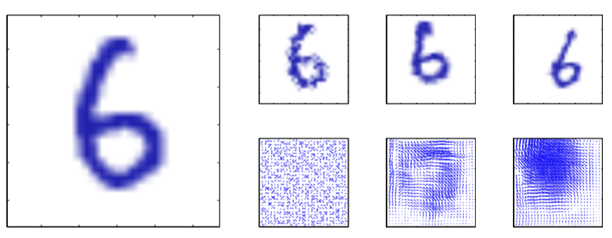

在许多模式识别的应用中，对输入变量进行了一个或多个变换之后，预测不应该发生变化，或者说应该具有不变性（invariant）。如，在二维图像（如手写数字）的分类问题中，一个特定的图像的类别应该与图像的位置无关（平移不变性 translation invariance），也应该与图像的大小无关（缩放不变性 scale
invariance）。这样的变换对于原始数据（用图像的每个像素的灰度值表示）产生了巨大的改变，但是分类系统还是应该给出同样的输出。同样的，在语音识别中，对于时间轴的微小的非线性变形（保持了时间顺序）不应该改变信号的意义。    

如果有足够多的训练模式可用，那么可调节的模型（如神经网络）可以学习到不变性，至少可以近似地学习到。这涉及到在训练集里包含足够多的表示各种变换的效果的样本。因此，对于一个图像的平移不变性，训练集应该包含图像出现在多个不同位置的情况下的数据。     

但是，如果训练样本数受限，或有多个不变性（变换的组合的数量随着变换的数量指数增长），那么这种方法就很不实用。于是，我们要寻找另外的方法来让可调节的模型具有所需的不变性。这些方法大致可以分为四类：    

1. 通过复制训练模式，同时根据要求的不变性进行变换，对训练集进行扩展。如：在手写数字识别的例子中，我们可以将每个样本复制多次，并把它们移到不同的位置。     
2. 为误差函数加上一个正则化项，用来惩罚当输入进行变换时，输出发生的改变。这引出了 5.5.4节讨论的切线传播（tangent propagation）方法。    
3. 通过抽取在要求的变换下不发生改变的特征，不变性被整合到预处理过程中。任何后续的使用这些特征作为输入的回归或分类系统就会具有这些不变性。    
4. 最后一种方法是把不变性的性质整合到神经网络的构建过程中（或对于相关向量机的方法整合到核函数中）。达到这个目的的一种方法是通过使用局部接收场和共享权值，正如5.5.6节在卷积神经网络中讨论的那样。    

方法1通常实现起来相对简单，并且可以用来处理复杂的不变性，如图5.14所示。

      
图 5.14 对手写数字进行人工形变的说明

对于顺序训练算法，可以在模型观测到输入模式之前，对每个输入模式进行变换，从而使得循环处理的模式，每次都会经过不同的变换（从一个适当的概率分布中抽取）。对于批处理方法，通过将每个数据点复制多次，然后独立地变换每个副本，来产生类似的效果。使用这些扩展后的数据虽然计算开销比较大，但是可以大幅提升泛化能力（Simard et al., 2003）。    

方法2保持了数据集的不变性，而是给误差函数增加了一个正则化项。在5.5.5节，我们会看到方法1与方法2关系密切。    

方法3的一个优点是，对于训练集里没有包含的变换，它可以正确的推算。然而，因为这种特征不仅要具有所需的不变性，还不能丢失对于判别很有帮助的信息，所以找到符合要求的人工设计的特征很困难。    

