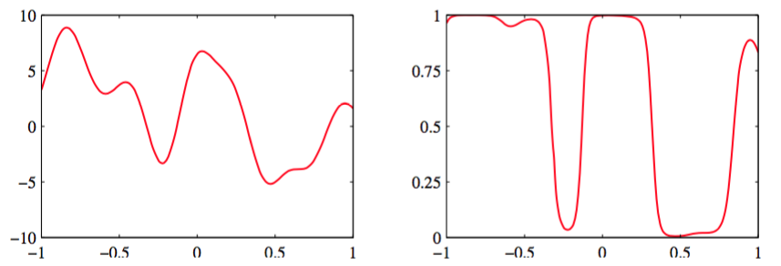

在分类的概率方法中，我们的目标是在给定一组训练数据的情况下，对于一个新的输入向量，为目标变量的后验概率建模。这些概率一定位于区间$$ (0, 1) $$中，而一个高斯过程模型做出的预测位于整个实数轴上。然而，我们可以很容易地通过使用一个恰当的非线性激活函数，将高斯过程的输出进行变换来调整高斯过程，使其能够处理分类问题。    

首先考虑一个二分类问题，它的目标变量为$$ t \in \{0, 1\} $$。如果我们定义函数$$ a(x) $$上的一个高斯过程，然后使用式（4.59）给出的logistic sigmoid函数$$ y = \sigma(a) $$进行变换，那么我们就得到了函数$$ y(x) $$上的一个非高斯随机过程，其中$$ y \in (0, 1) $$。图6.11说明了一维输入空间的情况，其中目标变量$$ t $$上的概率分布是伯努利分布

$$
p(t|a) = \sigma(a)^t(1-\sigma(a))^{1-t} \tag{6.73}
$$

      
图 6.11 左图给出了在函数$$ a(x) $$上定义了一个高斯过程先验的样本，右图给出了使用logistic sigmoid对这 个样本进行变换得到的结果。

与之前一样，我们把训练集的输入记作$$ x_1,...,x_N $$，对应的观测目标变量为$$ t = (t_1,...,t_N)^T $$。我们还考虑一个单一的测试数据点$$ x_{N+1} $$，目标值为$$ t_{N+1} $$。我们的目标是确定预测分布$$ p(t_{N+1}|t) $$，其中我们没有显式地写出它对于输入变量的条件依赖。为了完成这个目标，我们引入向量$$ a_{N+1} $$上的高斯过程先验，它的分量为$$ a(x_1),...,a(x_{N+1}) $$。这反过来定义了$$ t_{N+1} $$上的一个非高斯过程。通过以训练数据$$ N
$$为条件，我们得到了求解的预测分布。$$ a_{N+1} $$上的高斯过程先验的形式为    

$$
p(a_{N+1}) = \mathcal{N}(a_{N+1}|0, C_{N+1}) \tag{6.74}
$$

与回归的情形不同，协方差矩阵不再包含噪声项，因为我们假设所有的训练数据点都被正确标记。然而，由于数值计算的原因，更方便的做法是引入一个由参数$$ v $$控制的类似噪声的项，它确保了协方差矩阵是正定的。因此协方差矩阵$$ C_{N+1} $$的元素为    

$$
C(x_n,x_m) = k(x_n,x_m) _ v\delta_{nm} \tag{6.75}
$$

其中$$ k(x_n,x_m) $$是6.2节讨论的一个任意的半正定核函数，$$ v $$的值通常事先固定。我们会假定核函数$$ k(x, x') $$由参数向量$$ \theta $$控制，我们稍后会讨论如何从训练数据中学习到$$ \theta $$。    

对于二分类问题，预测$$ p(t_{N+1} = 1|t_N) $$就足够了，因为$$ p(t_{N+1}=0|t_N) $$的值等于$$ 1−p(t_{N+1}=1|t_N) $$。求解的预测分布为    

$$
p(t_{N+1}=1|t_N) = \int p(t_{N+1}=1|a_{N+1})p(a_{N+1}|t_N)da_{N+1}  \tag{6.76}
$$

其中$$ p(t_{N+1}=1|a_{N+1}) = \sigma(a_{N+1}) $$。    

这个积分无法求出解析解，因此可以使用采样的方法近似(Neal, 1997)。我们还可以使用另一种基于一个解析的近似的方法。在4.5.2节，我们推导了logistic sigmoid函数与高斯 分布卷积的近似公式（4.153）。我们可以使用这个结果计算公式（6.76）中的积分，只要我们对后验概率分布$$ p(a_{N+1}|t_N) $$进行高斯近似。通常对后验概率进行高斯近似的理由是，根据中心极限定理，随着数据点数量的增加，真实的后验概率将会趋向于一个高斯分布。在高斯过程的情形中，变量的数量随着数据点数量的增多而增多，因此这个结果不能直接应用。然而，如果我们考虑增加落在x空间的固定区域中的数据点的数量，那么函数$$ a(x) $$中对应的不确定性就会减小，这就渐近地趋近于高斯分布(Williams and Barber, 1998)。     

我们考虑三种不同的获得高斯近似的方法。一种方法基于变分推断（variational inference）（Gibbs and MacKay, 2000），并且使用了logistic sigmoid函数的局部变分界（10.144）。这使得sigmoid函数的乘积可以通过高斯的乘积近似，因此使得对$$ a_N $$的积分可以解析地计算。这种方法也产生了似然函数$$ p(t_N|\theta)
$$的下界。通过使用softmax函数的高斯近似，高斯过程分类的变分法框架也可以扩展到多类$$ (K > 2) $$问题）Gibbs, 1997）。    

第二种方法使用期望传播（expectation propagation）（Opper and Winther, 2000b; Minka, 2001b; Seeger, 2003）。正如我们将看到的那样，由于真实的后验概率是单峰的，期望传播方法可以给出很好的结果。
